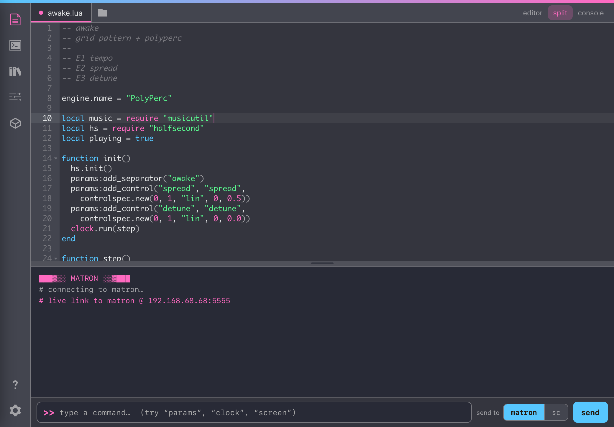
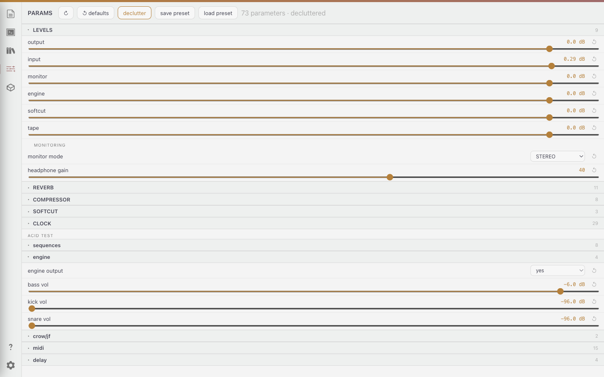
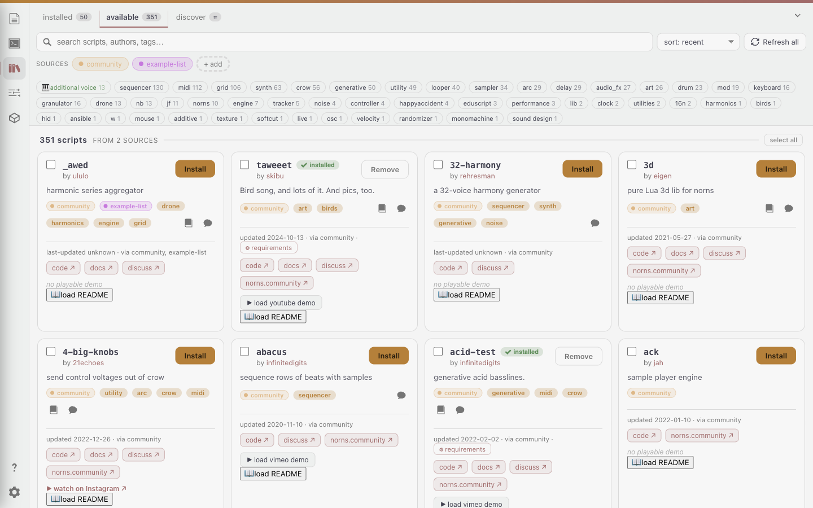
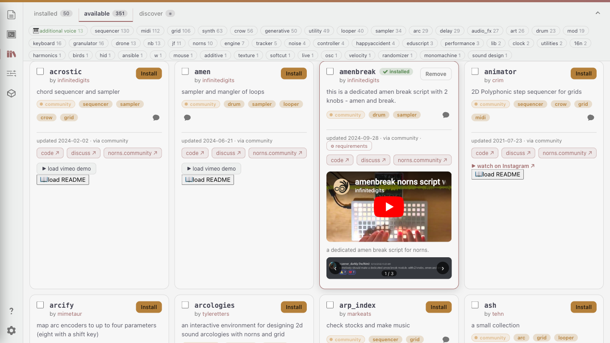
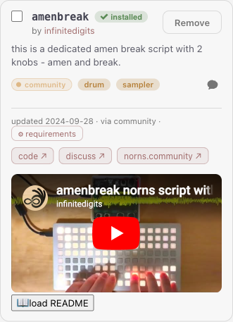
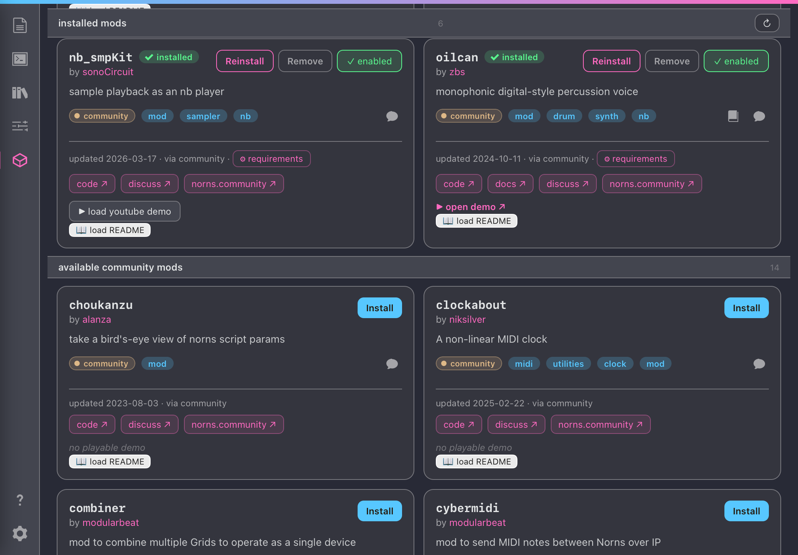
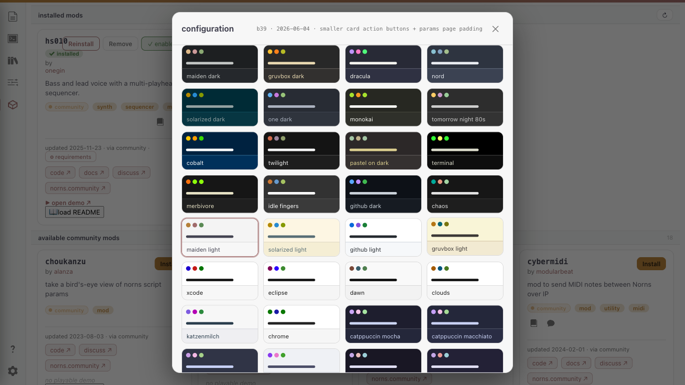
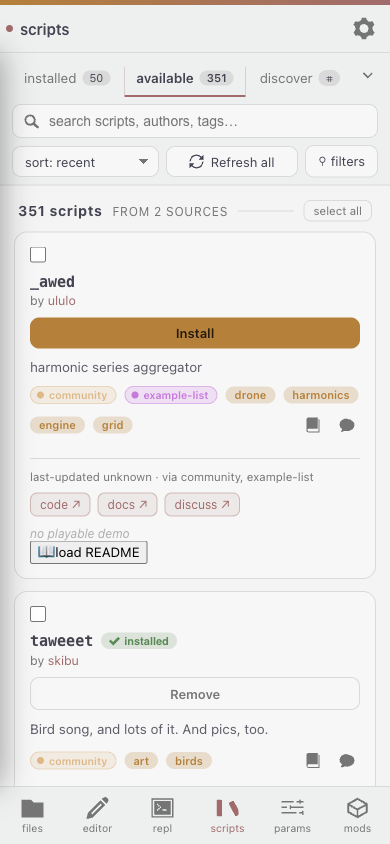
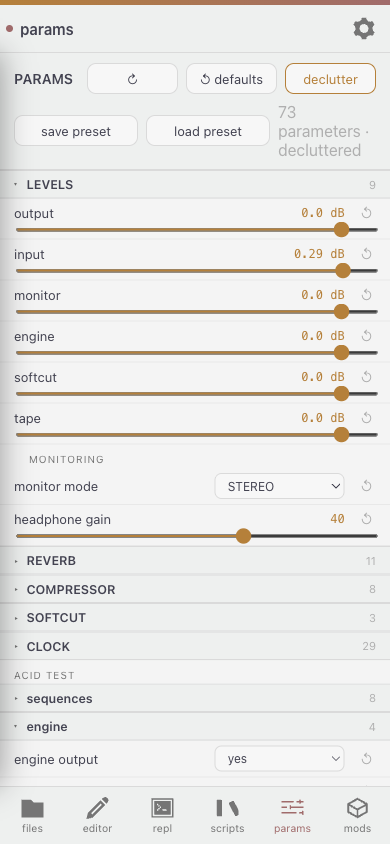
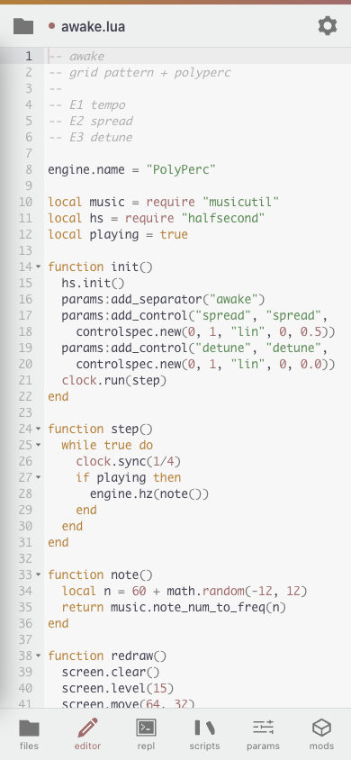

# ingenue

**A responsive, modern editor for [monome norns](https://monome.org/docs/norns/) — a
ground-up redesign of [maiden](https://monome.org/docs/norns/maiden/) that works beautifully
on phone, tablet, and desktop, and runs right on the device alongside maiden.**

Open it from any browser on your network — no app to install on your phone. ingenue talks
to your norns live: edit scripts, drive the REPL, tweak params in real time, browse and
install from the whole community catalog, and manage mods.



## Install on your norns

**From maiden** (no terminal needed) — in maiden's matron REPL:

```
;install https://github.com/seajaysec/ingenue
```

then **SELECT → ingenue** and run it once. It stands up the service and shows you the URL.

**Or over SSH** — run:

```bash
curl -fsSL https://raw.githubusercontent.com/seajaysec/ingenue/main/install.sh | bash
```

Either way it discovers your `dust` tree and runs ingenue as a persistent service on
**:7777** (always up, like maiden — survives reboots, auto-restarts). Then open
**`http://<your-norns-ip>:7777/`** from any device.

It does **not** replace or touch maiden; the two run side by side (maiden on :5000,
ingenue on :7777).

> Works on any norns. The installer prefers a `systemd` service; on ports without systemd it
> falls back to a boot line you can add. Override discovery with `INGENUE_DUST=/path/to/dust`.

## What it does

- **Live editor** — the real Ace editor (Lua), reads/writes your scripts on the device
  (`Ctrl/Cmd-S` saves), with a first-class file browser scoped to `dust` (mkdir / rename /
  delete / drag-drop upload).
- **Live REPL** — a real connection to matron over its websocket; run commands, see output.
- **Live PARAMS** — mirrors the on-device PARAMS menu: collapsible nested groups, dropdowns
  for options, sliders with the **true formatted values** (note names, scales, `dB`/`ms`,
  `1/16`…), per-param reset, presets, and a declutter toggle for empty device slots.
- **Repository manager** — the full community catalog (350+), search, sort, a real
  multi-select **tag filter** (with an auto *additional voice* tag for nb voices), source
  filters, GitHub discovery (your public **and** private repos), expandable cards with
  README + an **image carousel** and **embedded demos** (YouTube / Vimeo / SoundCloud), an
  install dock with per-job logs, bulk install, **engine-name deconfliction**, and
  **recursive dependency healing**.
- **Mods** — enable/disable installed mods (with restart reminders) and install community
  mods, all with full card detail.
- **64-bit plugin auto-heal** — on a 64-bit norns missing its SuperCollider UGen binaries,
  ingenue detects it and offers to install correct-arch builds it ships, so engine-based
  scripts make sound. (See [`DESIGN-NOTES.md`](DESIGN-NOTES.md).)
- **Audio-server health**, device info, and **137 color themes** (base16 + Catppuccin /
  Rosé Pine / Tokyo Night / … — editor syntax generated from every palette).

## Gallery

<details>
<summary><b>🖥 Desktop</b></summary>

<details><summary>Editor + live REPL</summary>


</details>

<details><summary>Live PARAMS — nested groups, dropdowns, note-name sliders</summary>


</details>

<details><summary>Repository manager — tag filter, cards, image carousel + demo embeds</summary>




</details>

<details><summary>Mods — installed + installable community mods</summary>


</details>

<details><summary>Themes — 137 schemes</summary>


</details>

</details>

<details>
<summary><b>📱 Phone</b></summary>

<details><summary>Repository manager</summary>


</details>

<details><summary>PARAMS</summary>


</details>

<details><summary>Editor</summary>


</details>

</details>

## Privacy

Your GitHub token lives **only** in the browser's localStorage and is sent **only** to
`api.github.com` over HTTPS — never to ingenue or any server.

## Layout

- `web/` — the app: `index.html` (single self-contained page), `server.py` (the on-device
  API over the dust tree), `community.json` + `enriched.json` (catalog + enrichment from the
  [`nornslist`](https://github.com/seajaysec/nornslist) scraper), `vendor/` (bundled 64-bit
  UGen pack).
- `install.sh` — the one-line installer above.
- `mcp/` — `maiden_mcp.py`, a companion MCP server (REPL, scripts, files, engines).
- `DESIGN-NOTES.md` — what's built + the backlog.

## Stretch goals (PRs welcome)

- **Browser → MIDI bridge for PARAMS** (Web MIDI: map a controller on your computer to the
  running script's params over the live matron link).
- **Safer wide-range param edits** (commit-on-tap for huge integer ranges).

See `DESIGN-NOTES.md` for the full backlog.

## Credits

Built for norns and the monome community. SuperCollider 64-bit UGen builds from
[seajaysec/sc-plugins-arm64](https://github.com/seajaysec/sc-plugins-arm64).

---

*Developed with AI assistance (Claude). All on-device testing and verification were performed
on real norns hardware. Validate before relying on it in performance.*
