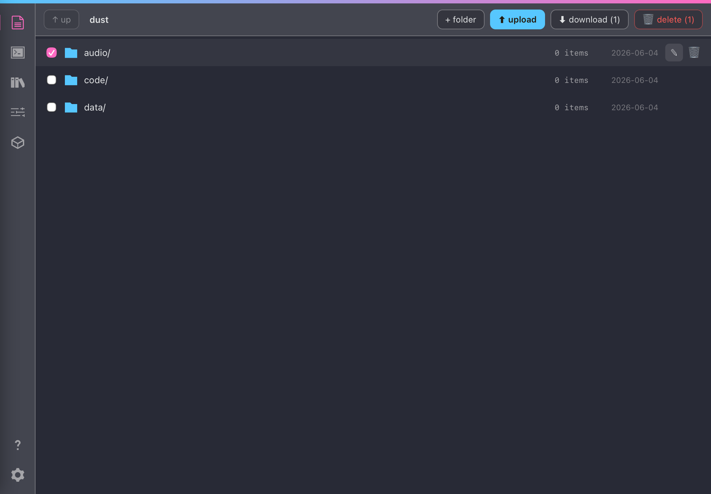
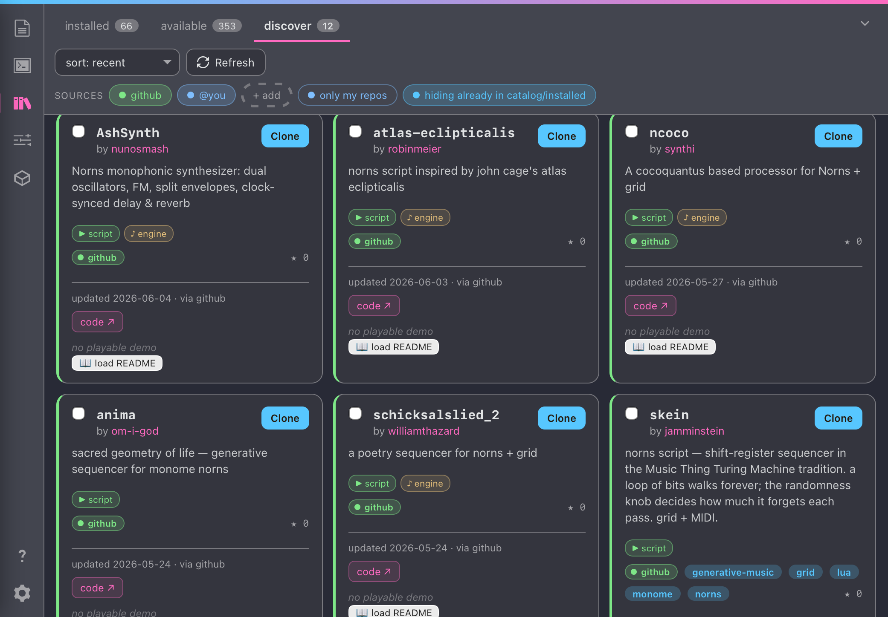
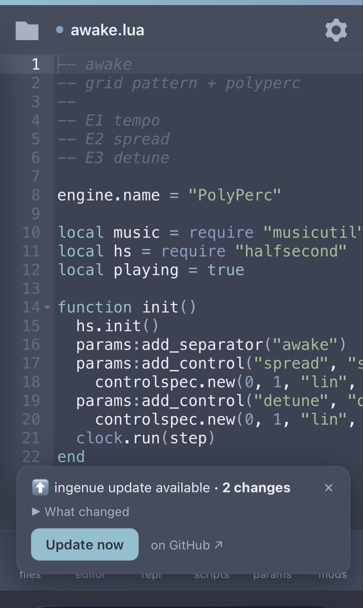
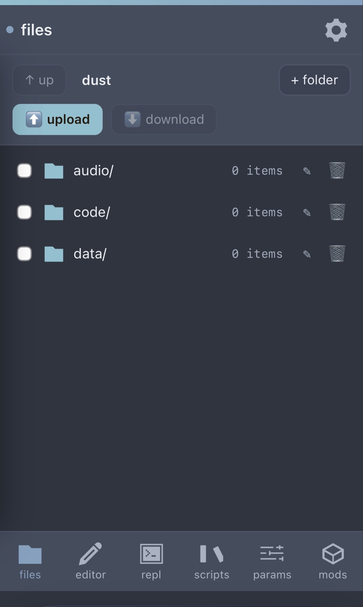
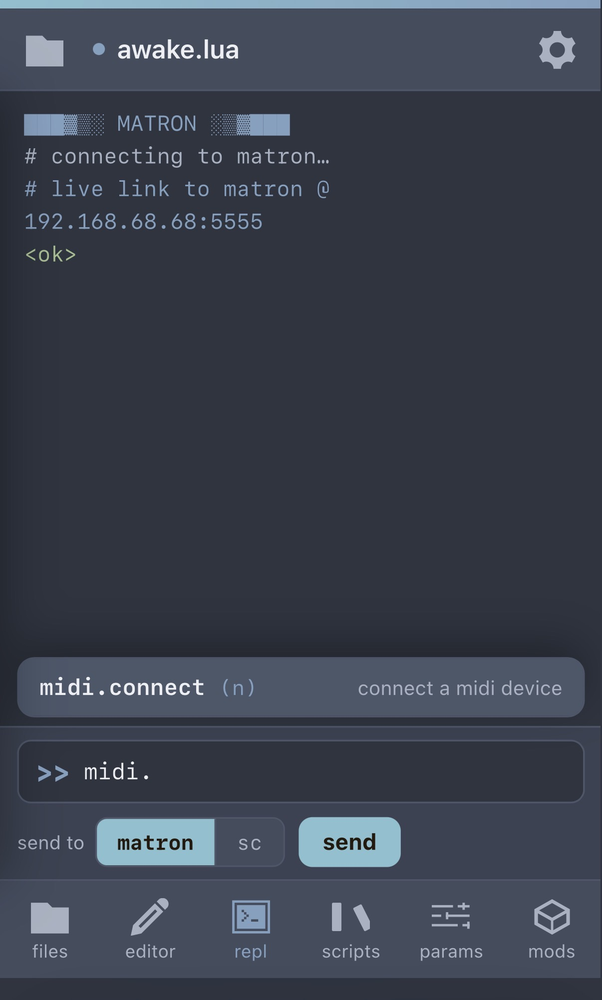
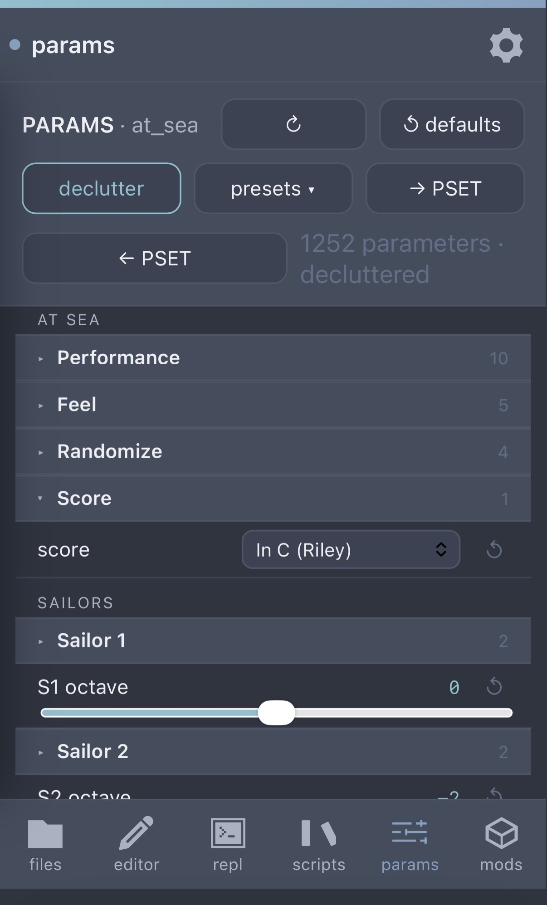
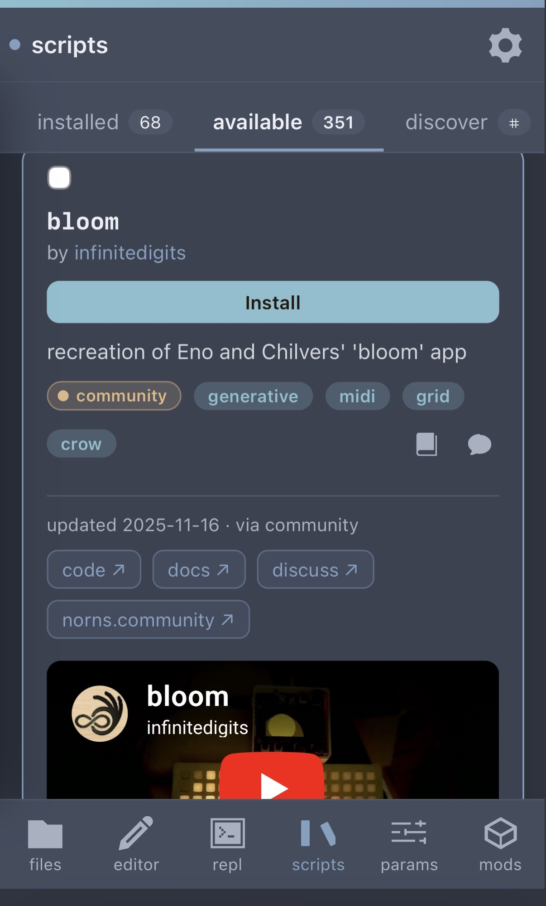
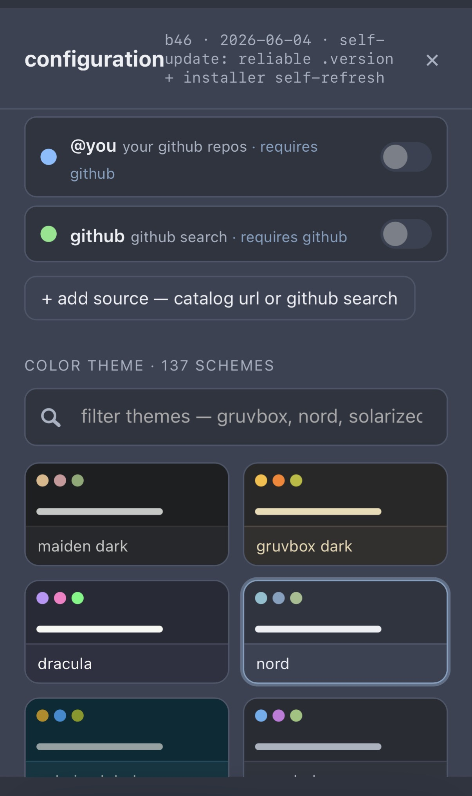

# ingenue

a responsive browser ui for [monome norns](https://monome.org/docs/norns/). it
runs on the device, opens from any browser on your network, and works on phone,
tablet, and desktop.

i've been using my norns for years and absolutely love it, and
[maiden](https://monome.org/docs/norns/maiden/) is a fantastic tool, but often
when i'm making music it's specifically so i'm *not* at my computer, and i kept
wishing i could reach my phone to install scripts, edit code, manage files,
tweak params. so, i built ingenue. it's a browser editor served from the device,
rebuilt to be responsive, plus a few other bits i've been scripting over the
years that seemed like they'd have a nice home in a responsive web ui.

this doesn't replace maiden, or touch it. ingenue installs as its own always-on
service on :7777 and the two sit side by side, so there's zero risk to your
setup. if you don't like it, run the uninstall script or remove the folder and
you're exactly where you started.

**poke around without a norns:** [seajaysec.github.io/ingenue](https://seajaysec.github.io/ingenue/)
is a static demo (every device call is faked, so nothing is connected to a real
norns, but the ui is the same one that runs on your device).


## install

from maiden's matron REPL (no terminal needed):

```
;install https://github.com/seajaysec/ingenue
```

then on norns, **SELECT → ingenue** and run it once to finish setup.

or over SSH:

```bash
curl -fsSL https://raw.githubusercontent.com/seajaysec/ingenue/main/install.sh | bash
```

either way it discovers your `dust` tree and runs ingenue as a persistent
service on :7777 (always up, like maiden, survives reboots, auto-restarts). then
open `http://norns.local:7777/` (or `http://<your-norns-ip>:7777/`) from any
device on your network.

> works on any norns. the installer prefers a `systemd` service; on older ports
> without systemd it falls back to a boot line you can add. you can override
> discovery with `INGENUE_DUST=/path/to/dust`.

## the parts i'm most happy with

- a responsive ui, with theming (137 schemes: base16 + Catppuccin / Rosé Pine /
  Tokyo Night, with editor syntax generated from each palette)
- a browser editor (Ace), reading and writing scripts on the device, Ctrl/Cmd-S
  saves
- a live matron REPL over its websocket: run commands, see output
- live on-norns parameter editing in the browser:
  - edits go both ways in real time
  - nested groups, dropdowns, sliders that show the real formatted values (note
    names, scales, dB/ms, 1/16, etc.), per-param reset, and a declutter toggle
    for empty device slots
  - on-device PSET management is there, plus browser preset slots and a JSON
    export/import so you can back up or share a patch with other people using
    ingenue. preset import is gated to the script it came from, so a preset
    only loads back where it belongs.
- a script repository browser, made for a touch ui:
  - the whole community catalog (350+), with search, sort, and a multi-select
    tag filter
  - cards pull in the README, screenshots, and embedded demo videos / audio
    where available (YouTube, Vimeo, SoundCloud)
  - bulk install with per-job logs
- optionally, if you supply a GitHub token, ingenue can also:
  - find and install public and private scripts in your own GitHub repos
  - search across every norns repo on GitHub (not just the catalog), classified
    by what the code actually is and badged by facet (`script`, `mod`,
    `library`, `engine`), so mods and shared libraries are first-class. repos
    already in the catalog or installed are skipped by default. click any
    author to see everything they've made for norns.
  - your token stays in your browser's localStorage and is only sent to
    api.github.com over HTTPS (never to ingenue or any server)
  - **create it safely:** treat the token like a password. prefer a
    [fine-grained token](https://github.com/settings/tokens?type=beta) scoped to
    only the repos you need (read-only **Contents** + **Metadata**), or a classic
    token with the minimum scope — `public_repo` + `read:user` for public repos,
    or `repo` only if you need private ones. set a short expiration, and
    [revoke it](https://github.com/settings/tokens) any time. because it lives in
    your browser, a narrow, expiring token keeps the blast radius small if it
    ever leaks.
- dependency healing on script install: when a script needs samples or other
  scripts, ingenue traces the whole chain and runs the installers in a
  port-tolerant way. if a setup step fails, it can retry on its own without
  re-cloning.
- if a script installs a library that would conflict with another by name, you
  get options for how to resolve it (including renaming), instead of the script
  silently going wrong later
- a mods manager: enable/disable installed mods (with restart reminders) and
  install community mods. mods are identified structurally (`lib/mod.lua`)
  rather than from a hand-tagged list, so they aren't dropped.
- a file manager: mkdir, rename, delete, drag-drop upload, scoped to dust
- in-app updates: on load ingenue checks GitHub for a newer build and, if
  there's one, shows an unobtrusive toast with the changelog and a one-tap
  *update now* that pulls and restarts the service for you (no SSH, no
  re-running the installer)

bonus, for the modern norns porting crowd: on a 64-bit norns the community
SuperCollider plugins ship as 32-bit, so engines load but play silent. ingenue
detects that and offers to install matching 64-bit builds it ships. (more in
[`DESIGN-NOTES.md`](DESIGN-NOTES.md).)

## gallery

<details>
<summary><b>🖥 Desktop</b></summary>

<details><summary>editor + live REPL</summary>


</details>

<details><summary>file browser: dust tree, with select, upload, download, mkdir, rename, delete</summary>


</details>

<details><summary>PARAMS: nested groups, presets, PSET, note-name sliders</summary>


</details>

<details><summary>repository manager: tag filter, cards, embedded demos</summary>


</details>

<details><summary>GitHub discovery: facet-classified results</summary>

every norns repo on GitHub, badged by facet (`script` / `mod` / `library` /
`engine`) so mods and shared libraries are first-class. already-cataloged or
installed repos are skipped by default. click any author to see everything
they've made for norns.


</details>

<details><summary>mods: installed + installable community mods</summary>


</details>

</details>

<details>
<summary><b>📱 Phone</b></summary>

<details><summary>editor (with the in-app update toast)</summary>


</details>

<details><summary>file browser</summary>


</details>

<details><summary>matron REPL: live link to the device</summary>


</details>

<details><summary>PARAMS</summary>


</details>

<details><summary>scripts: installed / available / discover</summary>


</details>

<details><summary>configuration + themes</summary>


</details>

</details>

## layout

- `web/` is the app: `index.html` (a single self-contained page), `server.py`
  (the on-device API over the dust tree), `community.json` + `enriched.json` +
  `feed.json` (catalog, enrichment, and per-repo facets from the
  [nornslist](https://github.com/seajaysec/nornslist) scraper), and `vendor/`
  (the bundled 64-bit UGen pack).
- `install.sh` is the one-line installer above.
- `DESIGN-NOTES.md` covers what's built and what's on the backlog.

## stretch goals (PRs welcome)

- a browser → MIDI bridge for PARAMS, using Web MIDI, so you could map a
  controller on your computer to the running script's params over the live
  matron link
- safer wide-range param edits (commit-on-tap for huge integer ranges)

more in `DESIGN-NOTES.md`.

## credits

built for norns and the monome community. 64-bit SuperCollider UGen builds from
[seajaysec/sc-plugins-arm64](https://github.com/seajaysec/sc-plugins-arm64).

## LLM disclosure

the code for ingenue was written with substantial help from an AI coding
assistant (Claude). i directed the design and architecture, set the feature
priorities, and did all the testing and verification myself on real norns
hardware, as well as on a 64-bit norns OS port.

flagging this plainly so everyone can decide for themselves how they want to
engage with it.
